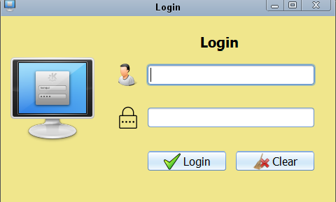
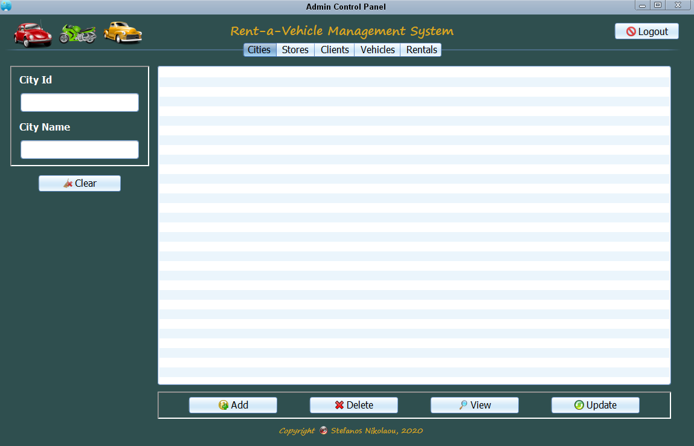

# Rental Company Management System
This project is about an application for a rent-a-vehicle company. The application
was developed in Java programming language, using REST Web Services (Jersey) and Hibernate.

* Backend: Java
* Frontend: Java (Swing)
* Database: MySQL

# Login screenshot

# ControlPanel screenshot

